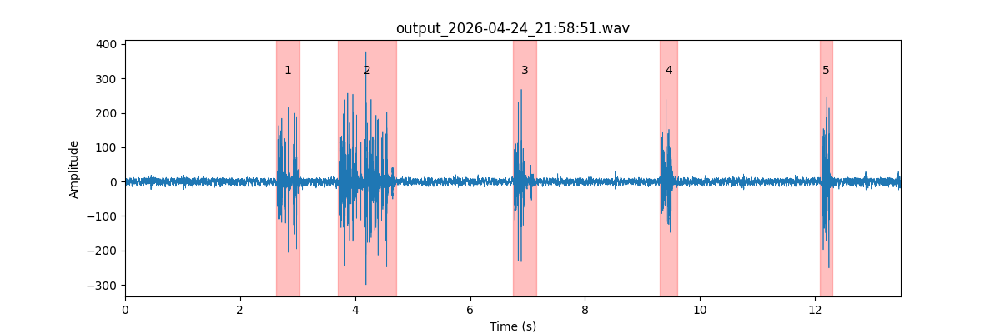
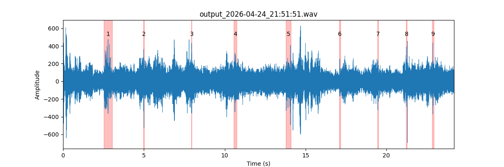
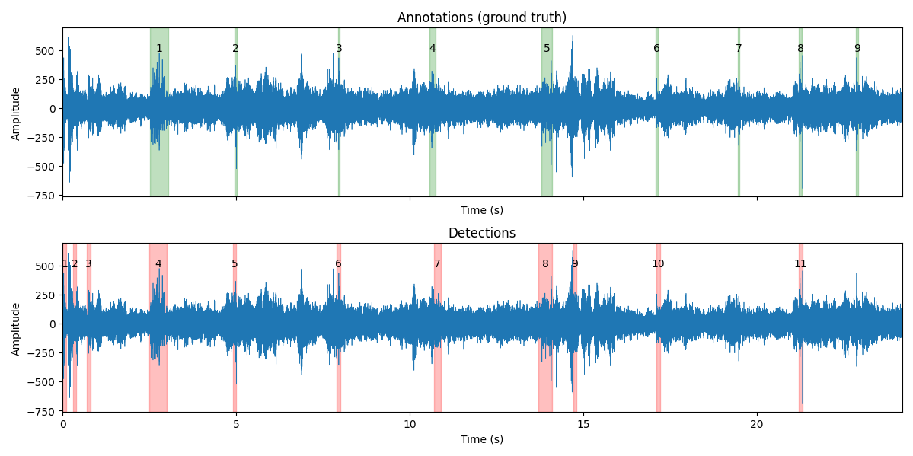

# Globoka fermentacija

Zvočni detektor mehurčkov.

Projekt za predmet Globoko učenje na UL FRI.

## Predpriprava

```bash
uv sync
```

### 1. Vizualizacija zvočnega posnetka
```bash
uv run -m src.main visualize_waveform output_2026-04-24_21:51:08.wav
```

### 2. Testiranje posameznega detektorja
```bash
uv run -m src.main train_detector constant
uv run -m src.main train_detector svm --preprocessor stft
```
(ne prikazuje vizualizacij)

### 3. Vizualizacija detekcij
```bash
uv run -m src.main train_detector constant --file output_2026-04-24_21:51:08.wav
```

### 4. Testiranje vseh detektorjev
```bash
uv run -m src.main train_detector
```
(ne prikazuje vizualizacij)

### V splošnem
```bash
uv run -m src.main train_detector [detector] [--preprocessor preprocessor] [--file filename]
```
Možni detektorji: `constant`, `svm`, `random_forest`, `cnn`, `lstm` (privzeto: vsi).  
Možni predprocesorji: `identity`, `stft`, `bandpass` (privzeto: `identity`).  
Možni zvočni posnetki: ime `.wav` datoteke v mapi `data/` (privzeto: vse).

# Primeri

## Anotacije podatkov



## Detekcije

